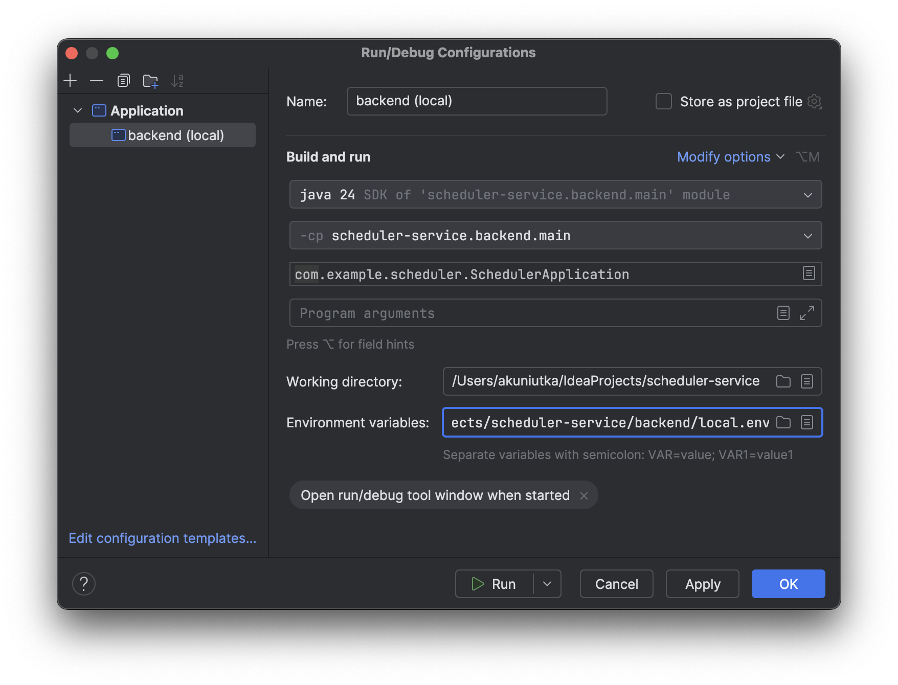

# Scheduler Service

Сервис для планирования встреч один-на-один и групповых встреч.

---

### Как развернуть приложение на сервере

Docker-образ с приложением хранится в GitHub Container Registry и перед первым запуском необходимо:
- подключить указанный реестр к Docker Compose,
- скачать файл [compose-prod.yaml](compose-prod.yaml),
- установить значения для используемых приложением переменных окружения.

#### Подключение GitHub Container Registry

Для подключения GitHub Container Registry требуется токен доступа, который можно создать в настройках своего профиля на 
GitHub: Settings > Developer settings > Personal access tokens > Tokens (classic) ([инструкция](https://docs.github.com/en/authentication/keeping-your-account-and-data-secure/managing-your-personal-access-tokens#creating-a-personal-access-token-classic)).
Достаточно, чтобы у токена была область действия [`read:packages`](https://docs.github.com/en/packages/learn-github-packages/about-permissions-for-github-packages#about-scopes-and-permissions-for-package-registries).

Используя указанный токен в качестве пароля и профиль на GitHub в качестве имени пользователя, подключите GitHub 
Container Registry:
```bash
docker login ghcr.io
```

> [!NOTE]
> Если вы сохранили токен в переменной окружения (например, в `GHCR_TOKEN`), то команду для подключения можно  
> модифицировать следующим образом:
> ```bash
> echo $GHCR_TOKEN | docker login ghcr.io -u USERNAME --password-stdin
> ```
> где вместо `USERNAME` следует указать профиль на GitHub.

#### Переменные окружения для запуска на сервере

- `SCHEDULER_DATABASE_NAME` - имя базы данных.
- `SCHEDULER_DATABASE_USERNAME` - имя пользователя, используемое для доступа к базе данных (не связано с пользователями
  приложения).
- `SCHEDULER_DATABASE_PASSWORD` - пароль для доступа к базе данных (тоже не связан с доступом в само приложение).
- `SCHEDULER_EXTERNAL_PORT` - порт, по которому доступно само приложение.
- `SCHEDULER_JWT_ACCESS_SECRET` - секретный ключ, используемый при генерации access token'ов.
- `SCHEDULER_JWT_REFRESH_SECRET` - секретный ключ, используемый при генерации refresh token'ов.
- `SCHEDULER_JWT_ACCESS_TOKEN_TTL` - срок действия access token'а в миллисекундах, рекомендуем установить равным
  3600000 (1 час).
- `SCHEDULER_JWT_REFRESH_TOKEN_TTL` - срок действия refresh token'а в миллисекундах, рекомендуем установить равным
  86400000 (1 сутки).

> [!NOTE]
> Можно также создать файл `prod.env` и сохранить переменные окружения в нём, Docker Compose при запуске приложения 
> возьмёт настройки из этого файла.

#### Запуск приложения

Для запуска приложения выполните следующую команду:
```bash
docker compose -f compose-prod.yaml pull && docker compose -f compose-prod.yaml up -d
```

#### Обновление версии приложения

Чтобы обновить версию приложений, повторите команду для его запуска:
```bash
docker compose -f compose-prod.yaml pull && docker compose -f compose-prod.yaml up -d
```

Docker Compose автоматически загрузит Docker-образ с новой версией приложений и обновит запущенный контейнер.

#### Запуск приложения на тестовом стенде

Для создания тестового полигона повторите шаги выше по запуску приложения на сервере, используя вместо 
`compose-prod.yaml` файл [`compose-test.yaml`](compose-test.yaml) и вместо `prod.env` — файл `test.env`.

> [!NOTE]
> Версия приложения для тестового полигона уже содержит несколько тестовых пользователей и событий.

### Как запустить приложение локально

Для запуска приложения на локальном компьютере необходимо:
- активировать в приложении Spring-профиль `local` и,
- установить значения для переменных окружения, используемых приложением и Docker Compose (в Docker Compose 
разворачивается база данных).

> [!NOTE]
> Spring Boot позволяет активировать нужный Spring-профиль через переменную окружения, поэтому оба пункта можно 
> объединить в один. 

#### Переменные окружения для локального запуска

- `SPRING_PROFILES_ACTIVE` - Spring-профиль (`local`), если активируем его через переменную окружения.
- `SCHEDULER_DATABASE_NAME` - имя базы данных.
- `SCHEDULER_DATABASE_USERNAME` - имя пользователя, используемое для доступа к базе данных (не связано с пользователями 
приложения).
- `SCHEDULER_DATABASE_PASSWORD` - пароль для доступа к базе данных (также не связан с доступом в само приложение).
- `SCHEDULER_DATABASE_EXTERNAL_PORT` - порт на localhost, по которому доступна база данных (внутри Docker Compose 
база данных использует стандартный для PostgreSQL порт 5432, данная настройка определяет порт для доступа к 
базе ланных извне).
- `SCHEDULER_EXTERNAL_PORT` - порт на localhost, по которому доступно само приложение.
- `SCHEDULER_JWT_ACCESS_SECRET` - секретный ключ, используемый при генерации access token'ов (для создания ключа 
воспользуйтесь методом `main()` класса 
[`com.example.scheduler.infrastructure.util.SecretUtil`](src/main/java/com/example/scheduler/infrastructure/util/SecretUtil.java)).
- `SCHEDULER_JWT_REFRESH_SECRET` - секретный ключ, используемый при генерации refresh token'ов (аналогично см. метод
`main()` класса
[`com.example.scheduler.infrastructure.util.SecretUtil`](src/main/java/com/example/scheduler/infrastructure/util/SecretUtil.java)).
- `SCHEDULER_JWT_ACCESS_TOKEN_TTL` - срок действия access token'а в миллисекундах, рекомендуем установить равным 
3600000 (1 час).
- `SCHEDULER_JWT_REFRESH_TOKEN_TTL` - срок действия refresh token'а в миллисекундах, рекомендуем установить равным
86400000 (1 сутки).

> [!NOTE]
> Рекомендуем создать файл `local.env` и сохранить переменные окружения в нём. В IntelliJ IDEA есть возможность 
> [использовать](#как-подключить-файл-с-переменными-окружения-в-intellij-idea) этот файл при запуске приложения.

#### Как подключить файл с переменными окружения в IntelliJ IDEA

Если переменные окружения сохранены в файле, путь к этому файлу можно указать в поле "Environment variables" 
диалогового окна "Run/Debug Configurations" (Run > Edit Configurations... > выбрать либо создать нужную конфигурацию > 
Modify options > Environment variables):



#### Как вернуть базу данных в исходное состояние

По умолчанию Docker Compose при завершении приложения останавливает контейнер с базой данных, но не удаляет его. Это 
позволяет сохранять состояние базы данных между перезапусками приложения. Если требуется очистить базу данных, выполните 
в терминале команду:

```bash
docker compose -f backend/compose-local.yaml down
```

Docker Compose удалит текущий контейнер с базой данных и при следующем запуске приложения создаст базу данных заново.

#### Как синхронизировать часовой пояс базы данных и приложения

По умолчанию Docker Compose запускает контейнер с базой данных в часовом поясе UTC+0:

```
# SELECT now() AS now;
              now              
-------------------------------
 2025-07-20 10:01:14.574742+00
(1 row)
```

Чтобы приложение работало в одном часовом поясе с базой данных, рекомендуем при запуске приложения добавить для JVM 
ключ `user.timezone` с значением `UTC` (Run > Edit Configurations... > выбрать либо создать нужную
конфигурацию > Modify options > Add VM options):


---
